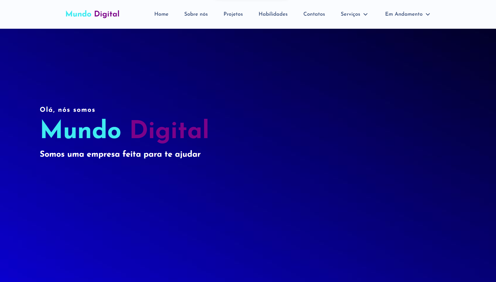

<h1 align="center">
  💻 Mundo Digital -  Pablo Santos
</h1>

<h4 align="center"><a href="https://pablo-m-santos.github.io/Mundo-Digital/">Clique para visitar o projeto</a></h4>

## 🌳 Projeto
O Mundo Digital é como uma caixa de ferramentas para amantes da matemática, oferecendo uma variedade de recursos para todos os tipos de cálculos, desde os básicos até os mais avançados.
## 📃 Seções
O Mundo DIgital é composto por 7 seções diferentes:

  -  Seção Home;
  -  Seção IMC;
  -  Seção Consumo de Energia;
  -  Seção Área de Figuras Planas;
  -  Seção Juros Simples;
  -  Seção Juros Compostos;
  -  Seção Contato;

## 👨🏽‍💻 Tecnologias utilizadas
  - Visual Studio Code;
  - HTML ;
  - Css;
  - JavaScript
